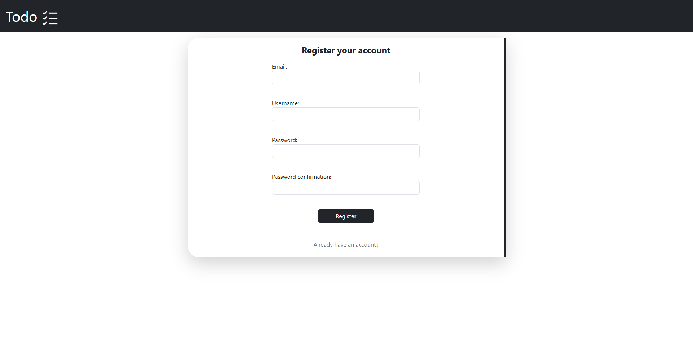
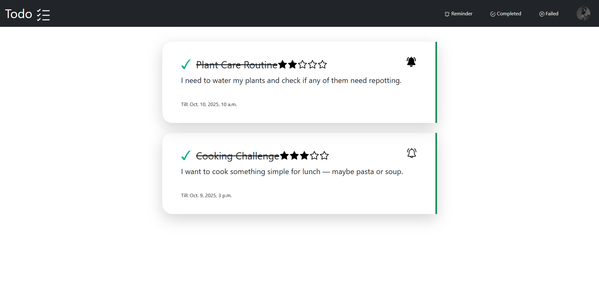

# Django Todo App

A simple Todo application built with Django, Celery, and Redis.

This project allows users to create, update, and delete tasks, with optional reminders using Celery.

## Screenshots







## Features

- __Task Management__

  - Create, update, and delete tasks

  - Set task deadlines

  - Mark tasks as completed or pending

- __Reminders__

  - Set reminders when creating or editing a task

  - Receive notifications for upcoming tasks

- __Task Tracking__

  - View completed tasks

  - View overdue tasks

- __User Profile__

  - Edit and update user profile information

- __Admin Interface__

  - Manage users and tasks via Django admin
## Installation

1. Clone the repository

```bash
  git clone https://github.com/YuroOleg/todo_app.git
  cd todo_app
```

2. Create virtual environment 

```bash
    python -m venv venv
```

3. Activate your virtual environment 

```bash
    vent\scripts\Activate
```
4. Install dependencies

```bash
    pip install -r requirements.txt
```
    
## Environment Variables

To run this project, you will need to add the following environment variables to your .env file

`SECRET_KEY`

`DEBUG`

`ALLOWED_HOSTS`

`DATABASE_URL`

`CELERY_BROKER_URL`

`CELERY_RESULT_BACKEND`

`EMAIL_HOST_USER`

`EMAIL_HOST_PASSWORD`


## Database Setup

1. Apply migrations:

```bash
python manage.py migrate
```

2. You can also create a superuser:

```bash
python manage.py createsuperuser
```
## Running the Project

1. Start the Django development server:

```bash
python manage.py runserver
```

2. Start Celery worker (in another terminal):

```bash
celery -A todo worker -l info
```

> **Note:** Celery requires a message broker to work. 
> Make sure to install Redis on your local machine (or use another supported broker) 
> before running the project.